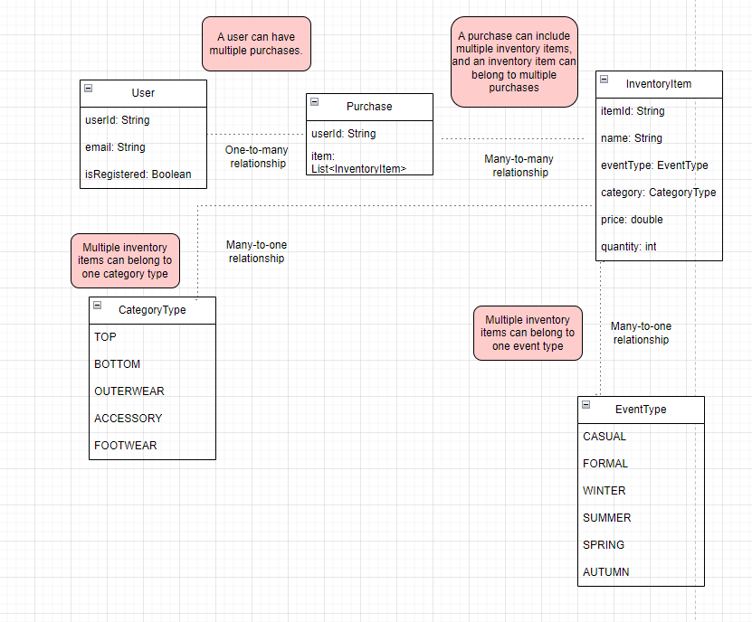

# Outfit Recommendation System

## Overview

The Outfit Recommendation System is a backend service designed to suggest outfit combinations for various events based on user preferences, purchase history, and available inventory. It generates personalized outfit recommendations for registered users and general recommendations for others.

## Features

- **Personalized Recommendations**: Uses user purchase history to suggest outfits.
- **General Recommendations**: Suggests outfits based on event types for non-registered users.
- **Budget Handling**: Considers user budget to provide outfit recommendations within the specified price range.
- **Outfit Combinations**: Generates multiple outfit combinations, taking into account categories and remaining budget.

## Architecture

The system consists of the following components:

1. **Recommendation Service**: Core logic for generating outfit recommendations.
2. **Model Classes**: Represents data entities like `InventoryItem`, `Purchase`, `User`, and `RecommendationRequest`.
3. **Endpoints**: API endpoints to receive user inputs and return recommendations.

**Architecture Diagram:**

   

**ERD:**



## Getting Started

### Setup

1. **Clone the Repository**

   ```sh
   git clone https://github.com/your-username/your-repository.git
   cd your-repository
